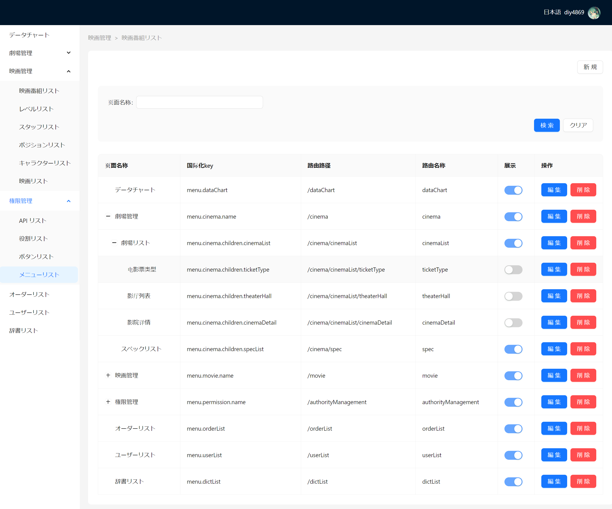

This is a [Next.js](https://nextjs.org/) project bootstrapped with [`create-next-app`](https://github.com/vercel/next.js/tree/canary/packages/create-next-app).

## Getting Started

First, run the development server:

```bash
npm run dev
# or
yarn dev
# or
pnpm dev
# or
bun dev
```

Open [http://localhost:3000/zh-CN/movie](http://localhost:3000/zh-CN/movie) with your browser to see the result.

You can start editing the page by modifying `app/page.tsx`. The page auto-updates as you edit the file.

## language

- Chinese
- Japanese


## 代办列表
- 数据隔离（影院只能查看自己的影院的信息，和订单以及场次）
- 搜索完善
- 座位拖拽选中bug
- 支付方式统计


> 功能
- 电影图片以及预告片列表
- 影院品牌
- 电影标签
- 标签: 字幕 舞台纪念 等
- 重映
- hello movie  (残障人士)
- 配音

## stack


## screenshot





